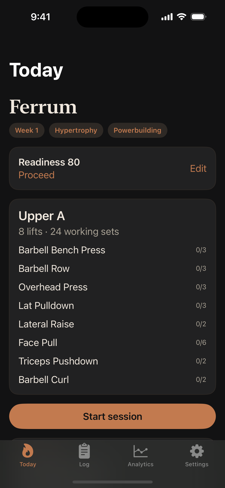
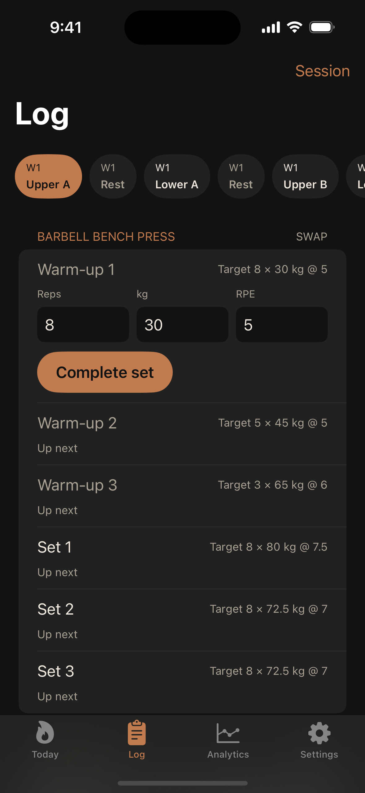
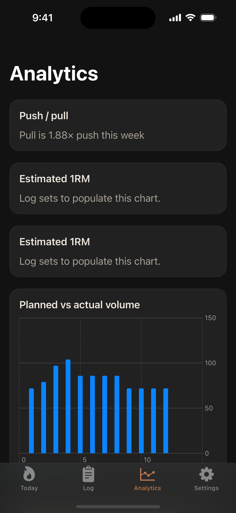

<p align="center">
  
</p>

# Ferrum

**Offline algorithmic strength coach for iOS.**

Ferrum builds a rule-based training program on device, checks daily readiness, auto-regulates loads from logged RPE, and keeps push/pull volume honest — with no accounts, no cloud, and no LLM.

## Screenshots

Captured from the iOS Simulator (iPhone 16).

<p align="center">
  
  &nbsp;
  
  &nbsp;
  
</p>

| Today | Log | Analytics |
| --- | --- | --- |
| Readiness, week/block, start session | Warm-ups, targets, rest days, set logging | Push/pull ratio, volume, 1RM trends |

## Features

- **Onboarding & profiling** — Powerlifting, Powerbuilding, Bodybuilding, or Hybrid; experience, bodyweight, optional squat/bench/deadlift/OHP PRs
- **Program engine** — 12-week Hypertrophy → Strength → Peaking blocks with rest days spread across the week
- **Volume landmarks** — MEV / MAV / MRV by muscle, scaled by experience, mode, and bodyweight
- **Pull bias** — Enforces at least 1:1 pull:push (target 1.2:1) plus weekly floors for upper back, lats, rear delts, hamstrings, and core
- **Daily readiness** — Sleep, energy, motivation, soreness, stress → 0–100 score with load/volume adjustments (or recovery day)
- **Workout logger** — Targets + actuals, warm-ups, undo, exercise swap, rest timer with +30s / haptic / sound
- **Auto-regulation** — Epley 1RM estimates; next-week loads from RPE vs target; weekly volume drifts toward MEV–MRV
- **Analytics** — Swift Charts for 1RM, planned vs actual volume, readiness, push/pull imbalance flags
- **Local-only data** — SwiftData persistence, CSV export, kg/lb display

## Architecture

```
jugger-not-power/
├── Ferrum/                 # SwiftUI app (MVVM + SwiftData)
│   ├── Models/
│   ├── Views/
│   ├── ViewModels/
│   ├── Services/
│   └── Utilities/
├── TrainingLogic/          # Pure Swift package (unit-tested, no UI)
│   ├── Sources/TrainingLogic/
│   └── Tests/TrainingLogicTests/
├── docs/images/            # App icon + Simulator screenshots
└── Ferrum.xcodeproj
```

Coaching algorithms live only in **TrainingLogic**:

| Engine | Role |
| --- | --- |
| `ProgramEngine` | Generates `[TrainingWeek]` from athlete profile |
| `ReadinessEngine` | Scores check-ins and applies band adjustments |
| `VolumeBalancer` | Pull/push ratio + muscle floors |
| `ProgressionEngine` | RPE-based load changes and weekly set drift |
| `OneRepMax` | Epley formula + working-load helpers |
| `ExerciseLibrary` | Local tagged exercise catalog |

## Requirements

- Xcode 16+ (iOS 18 SDK)
- macOS with Swift 6 toolchain for `swift test`
- No Apple Developer account needed for Simulator; set a Team in Xcode for device installs

## Run

```bash
open Ferrum.xcodeproj
```

Select an iOS 18 Simulator (or a device), then Run.

Optional CLI build:

```bash
xcodebuild \
  -project Ferrum.xcodeproj \
  -scheme Ferrum \
  -destination 'platform=iOS Simulator,name=iPhone 16' \
  CODE_SIGNING_ALLOWED=NO \
  build
```

## Refresh screenshots

```bash
./scripts/capture-screenshots.sh
```

Launches Ferrum on the iPhone 16 Simulator with `-demoScreenshots` demo data and overwrites `docs/images/ferrum-*.png`.

## Test

```bash
cd TrainingLogic
swift test
```

Covers readiness scoring, Epley 1RM, auto-regulation, volume balancing, and program generation (splits, 12-week blocks, floors, bodybuilding peak).

## Privacy

Ferrum is fully offline:

- No network calls
- No accounts or cloud sync
- No analytics SDKs
- All training data stays on the device (SwiftData + optional CSV export you control)

## License

All rights reserved unless otherwise noted. Add a license file if you want to open-source redistribution.
