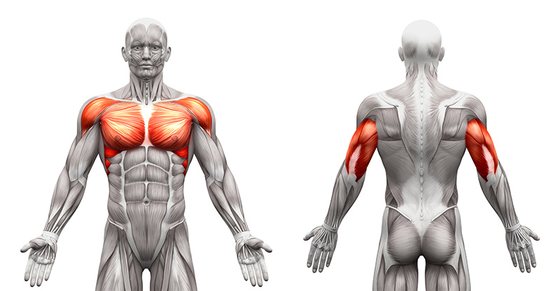
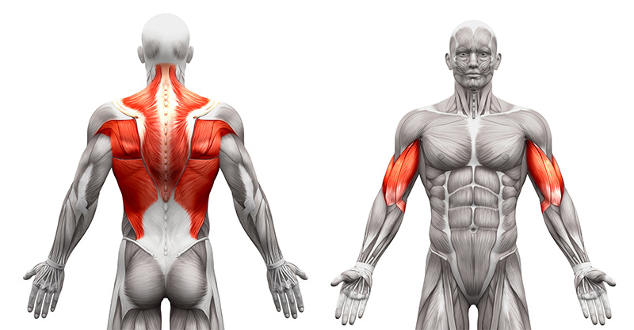
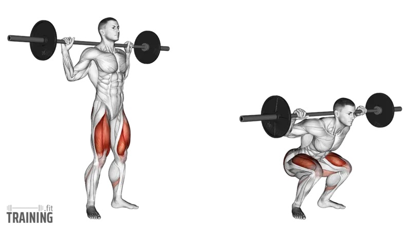

# Learn Section — Full Content

Contents: Key muscle groups · Strength patterns · Exercise catalog · RIR

---

# Part 1 — Key Muscle Groups

## Train the tissue, not just the lift

These are the muscle groups the guide tracks — function, training role, example lifts, and the movement patterns they belong to. Grouped by a push / pull / lower-body split.

## Push

Pressing and lockout work. Chest, delts, and triceps drive the load away from the torso; the core braces so the spine stays stacked.

### Chest (Pectorals)

*Upper body*

**Training role:** Prime mover on horizontal push; upper fibers assist incline and some overhead work.

**Function:** Shoulder horizontal adduction, flexion, internal rotation.

**Example exercises:** Bench Press, Incline Press, DB Fly, Decline Fly

**Movement patterns:** Horizontal Push, Deceleration / Catching

### Anterior Delts

*Upper body*

**Training role:** Prime mover on overhead pressing and the front-of-shoulder contribution to incline and bench work.

**Function:** Shoulder flexion. Front head of the deltoid on vertical and horizontal pushes.

**Example exercises:** OHP, Incline Press

**Movement patterns:** Vertical Push, Horizontal Push

### Lateral Delts

*Upper body*

**Training role:** Shoulder abduction and the cap of the deltoid on overhead presses and raises.

**Function:** Shoulder abduction. Lateral head that sets the arm path on vertical push.

**Example exercises:** Lateral Raise, DB Shoulder Press

**Movement patterns:** Vertical Push

### Triceps

*Arms*

**Training role:** Elbow extensor and press lockout. Shows up on every vertical and horizontal push, then again on isolation extensions.

**Function:** Elbow extension. Long head extends shoulder, lateral head stabilizes.

**Example exercises:** Pushdown, Skullcrusher, Diamond Push-up, Overhead Extension

**Movement patterns:** Vertical Push, Horizontal Push

### Core & Abs

*Trunk*

**Training role:** Brace, anti-motion, and some flexion/rotation. Treat it as a cylinder on compounds, then add anti-series and flexion work as needed.

**Function:** Spinal flexion, rotation, anti-extension, anti-rotation.

**Example exercises:** Cable Crunch, Dragon Fly, Russian Twist, Plank

**Movement patterns:** Anti-Rotation & Anti-Lateral, Rotational Acceleration, Loaded Carries

## Pull

Rows, pulldowns, and the upper-back wall. Lats, scapular retractors, and the arms that finish every pull.

### Lats

*Upper body*

**Training role:** Prime mover on vertical and horizontal pulls. Width and shoulder extension from overhead and from a row.

**Function:** Shoulder extension and adduction. Depresses the scapula on vertical pulls.

**Example exercises:** Pull-up, Lat Pulldown, Meadows Row

**Movement patterns:** Vertical Pull, Horizontal Pull

### Rhomboids

*Upper body*

**Training role:** Scapular retractors that build the upper-back wall behind every press.

**Function:** Scapular retraction. Pull the shoulder blades toward the spine.

**Example exercises:** Barbell Row, Seal Row, Face Pull

**Movement patterns:** Horizontal Pull

### Traps

*Upper body*

**Training role:** Postural wall on rows and the packed-shoulder work of carries.

**Function:** Scapular retraction, elevation, and upward rotation. Middle fibers retract; upper fibers support loaded carries.

**Example exercises:** Face Pull, Loaded Carry, Shrug-style work from pulls

**Movement patterns:** Horizontal Pull, Loaded Carries

### Erectors

*Trunk*

**Training role:** Spinal extensors that keep the trunk rigid on hinges and squats.

**Function:** Spinal extension and isometric bracing under axial load.

**Example exercises:** Deadlift, RDL, Back Squat

**Movement patterns:** Hinge Pattern, Squat Pattern

### Posterior Delts

*Upper body*

**Training role:** The rear head that balances pressing volume with horizontal pulling.

**Function:** Shoulder extension and external rotation. Posterior head of the deltoid.

**Example exercises:** Rear Delt Fly, Face Pull

**Movement patterns:** Horizontal Pull

### Biceps

*Arms*

**Training role:** Elbow flexor and pull accessory. Direct curls plus indirect work on every vertical and horizontal pull.

**Function:** Elbow flexion, supination. Long head contributes to shoulder flexion.

**Example exercises:** BB Curl, Hammer Curl, Preacher Curl, Reverse Curl

**Movement patterns:** Horizontal Pull, Vertical Pull

### Forearms & Grip

*Arms*

**Training role:** Limiters on pulls, hinges, and carries. Train grip so the hands are not the first thing to quit.

**Function:** Wrist flexion, extension, pronation, supination.

**Example exercises:** Wrist Curl, Reverse Curl, Pronation/Supination Twists

**Movement patterns:** Loaded Carries, Vertical Pull, Horizontal Pull

## Lower Body

Squat, hinge, and single-leg tissue. Quads, posterior chain, hips, and the lower-leg muscles that support stance and gait.

### Quadriceps

*Lower body*

**Training role:** Knee extension on squats, lunges, and jumps. The main knee-dominant engine.

**Function:** Knee extension, hip flexion.

**Example exercises:** Squat, Leg Extension, Bulgarian Split Squat, Goblet Squat

**Movement patterns:** Squat Pattern, Power / Triple Extension

### Hamstrings

*Lower body*

**Training role:** Hip extension on hinges plus knee flexion on curls. Pair with quads so the posterior chain is not an afterthought.

**Function:** Knee flexion, hip extension.

**Example exercises:** Nordic Curl, RDL, Glute Ham Raise, Leg Curl

**Movement patterns:** Hinge Pattern, Single-Leg Pattern

### Glutes

*Lower body*

**Training role:** Hip extension, abduction, and the finish of squats, hinges, and jumps.

**Function:** Hip extension, abduction, external rotation.

**Example exercises:** Step-ups, Lunges, Hip Thrust, RDL

**Movement patterns:** Squat Pattern, Hinge Pattern, Power / Triple Extension

### Calves

*Lower body*

**Training role:** Ankle plantarflexion and elastic stiffness for gait, jumps, and single-leg work.

**Function:** Plantarflexion (gastrocnemius and soleus).

**Example exercises:** Standing / Seated Calf Raise

**Movement patterns:** Single-Leg Pattern, Power / Triple Extension

### Tibialis

*Lower body*

**Training role:** Ankle dorsiflexion. The front-of-shin counterpart to the calves.

**Function:** Dorsiflexion (tibialis anterior).

**Example exercises:** Tibialis Raise

**Movement patterns:** Single-Leg Pattern

### Adductors

*Lower body*

**Training role:** Share squat depth and stance control. Pelvic stability on squats and lunges.

**Function:** Adduction (pull the leg in) and pelvic stability.

**Example exercises:** Copenhagen Adductor, Lateral Lunge

**Movement patterns:** Squat Pattern, Single-Leg Pattern

### Abductors

*Lower body*

**Training role:** Keep the pelvis level on lunges and single-leg work.

**Function:** Abduction (push the leg out) and pelvic stability.

**Example exercises:** Cable Side Extension, side-lying abduction

**Movement patterns:** Single-Leg Pattern, Anti-Rotation & Anti-Lateral

### Hip Flexors

*Lower body*

**Training role:** Swing-leg and knee-drive muscles. They stabilize the pelvis and show up in sprinting, hanging leg raises, and split-stance work.

**Function:** Hip flexion, stabilizes pelvis.

**Example exercises:** Reverse Squat, Hanging Leg Raise, Reverse Lunge

**Movement patterns:** Single-Leg Pattern, Power / Triple Extension

---

# Part 2 — Strength Patterns

## Categories

### Pushes

**What it is:** Move a load away from the torso. Vertical presses train overhead lockout and scapular upward rotation. Horizontal presses train the chest-dominant pattern of driving away from the sternum.

**Coaching notes:** Brace the trunk so the lumbar spine does not take the load. On overhead work, keep ribs down. On benching, retract the scapulae and keep a stable upper back. Lock out with the triceps instead of shrugging the finish.

**Example lifts:** Overhead press, push press, bench press, incline press, dip, push-up

**Patterns:** Vertical Push, Horizontal Push

### Pulls

**What it is:** Move a load toward the torso. Vertical pulls develop the lats through shoulder adduction and extension from overhead. Horizontal pulls train scapular retraction and the upper-back wall behind every press.

**Coaching notes:** Start the rep by setting the shoulders down and back, then drive the elbows. Avoid yanking with the wrists. Hold a brief squeeze at the peak, then lower under control so the scapulae work through a full range.

**Example lifts:** Pull-up, chin-up, lat pulldown, barbell row, chest-supported row, Meadows row, face pull

**Patterns:** Vertical Pull, Horizontal Pull

### Squat

**What it is:** A knee-dominant sit-to-stand. Hips and knees flex together so the quads, glutes, and adductors share the work. This is how you stand up from a chair, a hole, or a heavy bar on the back.

**Coaching notes:** Keep the trunk braced and the chest from collapsing. Depth to parallel or below if the hips and ankles allow it. Drive through midfoot, not the toes. Knees track over the feet instead of caving in.

**Example lifts:** Back squat, front squat, safety-bar squat, goblet squat, leg press

**Patterns:** Squat Pattern

### Hinge

**What it is:** A hip-dominant pattern with a relatively quiet knee. You push the hips back, load the hamstrings and glutes, then snap the hips through. Deadlifts, RDLs, and swings all live here.

**Coaching notes:** Maintain a neutral spine from head to tail. Push the hips back until you feel a hamstring stretch, then stand by squeezing the glutes rather than yanking the bar with the back. The bar stays close to the legs.

**Example lifts:** Conventional deadlift, Romanian deadlift, good morning, kettlebell swing, hip thrust

**Patterns:** Hinge Pattern

### Single-leg

**What it is:** Unilateral stance work. Split squats, lunges, step-ups, and single-leg hinges train each side on its own, plus the hip muscles that keep the pelvis level when you walk, run, or change direction.

**Coaching notes:** Keep the pelvis level and the knee tracking over the toes. Use a stride long enough that the back hip can extend. Slow the eccentric if balance is the limiter. Treat these as strength, not cardio, unless that is the point.

**Example lifts:** Bulgarian split squat, reverse lunge, walking lunge, step-up, single-leg RDL

**Patterns:** Single-Leg Pattern

### Loaded carries

**What it is:** Walk under load. Carries train gait, grip, packed shoulders, and anti-lateral flexion — the trunk resisting side-bend while the legs move. This is the sixth fundamental pattern alongside squat, hinge, push, pull, and lunge.

**Coaching notes:** Stand tall, lock the ribcage over the pelvis, and keep the shoulders packed without shrugging. Breathe continuously. If the load pulls you sideways, that is the training effect — do not lean into it.

**Example lifts:** Farmer carry, suitcase carry, front-rack carry, waiter carry, yoke walk

**Patterns:** Loaded Carries

## Patterns

### Vertical Push

*Category: Pushes*

**What it is:** Press weight overhead from shoulders to full lockout. Control descent.

**Why it matters:** Overhead pressing is how you put load above your head with a stable shoulder. It trains upward rotation of the scapula, lockout strength through the triceps, and a trunk that can stay stacked instead of dumping into the low back.

**Example exercises:** Barbell overhead press, dumbbell shoulder press, push press, landmine press, pike push-up

**Primary muscles:** Deltoids (anterior & lateral), Triceps, Upper Pectoralis

**Secondary muscles:** Trapezius, Serratus Anterior

**Equipment:** Dumbbells, Barbell, Kettlebell

**Coaching notes:** Keep core braced, avoid lumbar hyperextension.

### Horizontal Push

*Category: Pushes*

**What it is:** Press weight away from chest. Lower to sternum or mid-chest.

**Why it matters:** The most common gym press. Horizontal pushing builds the pecs and triceps and teaches a stiff upper back so the shoulder can move on a stable base. Pair it with horizontal pulling so the scapulae are not stuck in a rounded position.

**Example exercises:** Barbell bench press, incline press, dumbbell press, dip, push-up

**Primary muscles:** Pectoralis Major, Triceps, Anterior Deltoid

**Secondary muscles:** Serratus Anterior, Coracobrachialis

**Equipment:** Barbell, Dumbbells, Push-up bars

**Coaching notes:** Retract scapulae, maintain neutral spine.

### Vertical Pull

*Category: Pulls*

**What it is:** Pull weight down from overhead to chest or chin level.

**Why it matters:** Vertical pulling develops lat width and hanging strength. Depressing the scapulae before the elbows bend keeps the shoulders from shrugging into the ears and lets the lats do the work they are built for.

**Example exercises:** Pull-up, chin-up, lat pulldown, kneeling straight-arm pulldown

**Primary muscles:** Latissimus Dorsi, Teres Major, Biceps

**Secondary muscles:** Posterior Deltoids, Rhomboids

**Equipment:** Pull-up bar, Lat pulldown, Rings

**Coaching notes:** Depress scapulae, drive elbows down.

### Horizontal Pull

*Category: Pulls*

**What it is:** Pull weight toward torso while retracting scapulae.

**Why it matters:** Rows build the upper-back wall that every press needs. Scapular retraction and posterior-delt work keep the shoulder girdle balanced when pressing volume is high.

**Example exercises:** Barbell row, chest-supported row, Meadows row, cable row, face pull, seal row

**Primary muscles:** Rhomboids, Middle Trapezius, Posterior Deltoids, Biceps

**Secondary muscles:** Latissimus Dorsi, Teres Major

**Equipment:** Barbell, Dumbbells, Cable row, Meadows row

**Coaching notes:** Hold contraction at peak, avoid rounding lower back.

### Squat Pattern

*Category: Squat*

**What it is:** Descend by pushing hips back and knees forward. Keep chest up.

**Why it matters:** Squatting is the loaded sit-to-stand. It is the main knee-dominant strength pattern: quads, glutes, and adductors sharing a deep knee bend under a braced trunk.

**Example exercises:** Back squat, front squat, safety-bar squat, goblet squat, Bulgarian split squat (knee-dominant)

**Primary muscles:** Quadriceps, Gluteus Maximus, Adductors

**Secondary muscles:** Erectors, Core, Calves

**Equipment:** Barbell, Safety Squat Bar, Goblet Dumbbell

**Coaching notes:** Depth to parallel or below, drive through midfoot.

### Hinge Pattern

*Category: Hinge*

**What it is:** Hinge at hips with minimal knee bend, back straight.

**Why it matters:** The hinge is how you pick things up without turning it into a squat. Hip extension through the hamstrings and glutes is the posterior-chain counterpart to knee-dominant squatting.

**Example exercises:** Romanian deadlift, conventional deadlift, good morning, kettlebell swing, hip thrust

**Primary muscles:** Hamstrings, Gluteus Maximus, Erectors

**Secondary muscles:** Adductors, Core

**Equipment:** Barbell, Dumbbells, Kettlebell

**Coaching notes:** Push hips back, maintain neutral spine, feel hamstring stretch.

### Single-Leg Pattern

*Category: Single-Leg*

**What it is:** Lunge, step-up, or single-leg deadlift. Maintain stability.

**Why it matters:** Life and sport happen one leg at a time. Unilateral work exposes left-right gaps, trains pelvic control, and loads the lateral hip that bilateral squats can hide.

**Example exercises:** Walking lunge, reverse lunge, Bulgarian split squat, step-up, single-leg RDL

**Primary muscles:** Gluteus Medius, Quadriceps, Hamstrings, Calves

**Secondary muscles:** Core, Adductors

**Equipment:** Dumbbells, Kettlebell, TRX

**Coaching notes:** Knee tracking over toes, pelvis level.

### Anti-Rotation & Anti-Lateral

*Category: Rotational Core*

**What it is:** Resist rotation or side-bending while moving load.

**Why it matters:** Most hard lifting asks the trunk to be a cylinder, not a cruncher. Anti-rotation and anti-lateral work teach the obliques to brake unwanted twist and side-bend so the hips and shoulders can produce force.

**Example exercises:** Pallof press, landmine anti-rotation, suitcase hold, Copenhagen plank, side plank

**Primary muscles:** Obliques, Transverse Abdominis, Erector Spinae

**Secondary muscles:** Glutes, Lats

**Equipment:** Cable, Landmine, Kettlebell

**Coaching notes:** Brace core, keep ribs down, slow controlled reps.

### Rotational Acceleration

*Category: Rotational Core*

**What it is:** Explosively rotate torso from a stable stance.

**Why it matters:** Sport often needs rotation on purpose — throws, swings, cuts. Train it as power from the hips through a stiff trunk, not as a twist isolated to the lumbar spine.

**Example exercises:** Landmine rotation, cable woodchop, med-ball rotational throw, rotational slam

**Primary muscles:** Obliques, Rectus Abdominis, Erector Spinae

**Secondary muscles:** Hip flexors, Lats

**Equipment:** Cable, Landmine, Med Ball

**Coaching notes:** Generate power from hips, rotate as a unit.

### Loaded Carries

*Category: Carries*

**What it is:** Walk with load in one or both hands, maintain upright posture.

**Why it matters:** Carries are strength that has to travel. Grip, packed shoulders, and a trunk that resists side-bend while the legs walk — useful on its own and as a transfer to deadlifts, rows, and sport.

**Example exercises:** Farmer carry, suitcase carry, front-rack carry, waiter carry

**Primary muscles:** Core, Trapezius, Forearms, Glutes

**Secondary muscles:** Erectors, Quadratus Lumborum

**Equipment:** Kettlebells, Dumbbells, Suitcase handles

**Coaching notes:** Keep shoulders back, engage lats, breathe continuously.

### Power / Triple Extension

*Category: Athletic Transfers*

**What it is:** Explosive extension of hips, knees, and ankles against load.

**Why it matters:** Strength that cannot be expressed quickly is only half the quality. Triple extension trains rate of force: hips, knees, and ankles opening together, the same pattern as a jump, a sprint first step, or a clean.

**Example exercises:** Jump shrug, kettlebell swing, push press, broad jump, med-ball slam

**Primary muscles:** Glutes, Quadriceps, Calves, Erector Spinae

**Secondary muscles:** Deltoids, Trapezius

**Equipment:** Barbell, Kettlebell, Med Ball

**Coaching notes:** Start with hips high, accelerate through mid-thigh.

### Deceleration / Catching

*Category: Athletic Transfers*

**What it is:** Absorb impact by yielding through hips and chest.

**Why it matters:** Producing force is only half of athleticism. Catching and deceleration train the other half: yielding under control so landings, changes of direction, and eccentric presses do not dump into the joints.

**Example exercises:** Med-ball catch, snap-down, tempo eccentric press, drop-catch landing

**Primary muscles:** Anterior Deltoids, Pectorals, Core, Quads

**Secondary muscles:** Biceps, Forearms

**Equipment:** Med Ball, Dumbbells (eccentric)

**Coaching notes:** Stay braced, cushion force with soft elbows and knees.

## Additional Topics

### Anti-Extension

*Resist lumbar extension while the arms or legs move.*

**Why it matters:** Squats, deadlifts, and overhead presses all ask the trunk not to dump into a backbend. Anti-extension trains that brace so the hips and shoulders can load instead of the lumbar spine taking the motion.

**Examples:** Dead bug, ab wheel / rollout, hollow hold, plank with reach, stability-ball roll-out

**Coaching notes:** Ribs down, pelvis tucked just enough to keep a long low back. If the lumbar folds into extension, shorten the lever or slow the rep.

**Related patterns:** Anti-Rotation & Anti-Lateral, Loaded Carries, Vertical Push

### Anti-Rotation

*Resist twist through the trunk while a load tries to turn you.*

**Why it matters:** Rows, carries, and single-arm presses create rotational torque. The obliques’ job on those lifts is to brake that twist so force stays in the intended plane.

**Examples:** Pallof press, landmine anti-rotation, single-arm farmer hold, cable press-out

**Coaching notes:** Lock the ribcage to the pelvis and move the arms, not the waist. Slow the eccentric. Pair with rotational acceleration if the sport actually needs to create twist.

**Related patterns:** Anti-Rotation & Anti-Lateral, Loaded Carries

### Anti-Lateral Flexion

*Resist side-bend while standing, walking, or holding offset load.*

**Why it matters:** A suitcase carry or offset farmer walk is a moving side plank. The quadratus lumborum and obliques keep the ribcage stacked so the spine does not collapse toward the load.

**Examples:** Suitcase carry, side plank, offset farmer walk, single-arm overhead waiter's walk

**Coaching notes:** Stand tall. Do not lean into the weight or away from it. Breathe without letting the ribs flare on the loaded side.

**Related patterns:** Anti-Rotation & Anti-Lateral, Loaded Carries

### Rotation (Acceleration)

*Create rotation on purpose from the hips through a stiff trunk.*

**Why it matters:** Throws, swings, and cuts need rotational power. Train it as a unit — feet, hips, then torso — rather than grinding the lumbar spine in isolation.

**Examples:** Med-ball rotational throw, landmine rotation, cable woodchop, rotational slam

**Coaching notes:** Load the back hip, then unwind. Keep the chest and pelvis turning together. Use anti-rotation work as the brake that makes this acceleration useful.

**Related patterns:** Rotational Acceleration

### Sprinting

*Max-velocity locomotion: stiffness, hip extension, and front-side mechanics.*

**Why it matters:** Sprinting is the high-speed expression of hinge, single-leg, and triple-extension qualities. Short accelerations also train intent that heavy barbell work does not.

**Examples:** Hill sprints, 10–30 m accelerations, wickets, sled marches into a sprint

**Coaching notes:** Treat these as quality, not volume. Full recoveries. Build the hinge, single-leg, and calf stiffness in the weight room, then express it on the run.

**Related patterns:** Power / Triple Extension, Single-Leg Pattern, Hinge Pattern

### Rotational Throwing

*Hip-to-shoulder power into a throw or toss.*

**Why it matters:** A rotational throw is rotational acceleration with an implement leaving the hands. It is a clean way to train power without loading the spine axially.

**Examples:** Med-ball rotational scoop toss, shot-put style throw, rotational slam, landmine punch

**Coaching notes:** Push the ground away, then let the arms follow. Catch or reset with a brace so the deceleration half of the throw is trained too.

**Related patterns:** Rotational Acceleration, Deceleration / Catching, Power / Triple Extension

### Shoulder

*Joint-prep for a shoulder that presses, pulls, and hangs.*

**Why it matters:** The glenohumeral joint lives on the scapula. Healthy pressing usually means the upper back can retract and the scapula can upwardly rotate, not just that the delts are strong.

**Examples:** Face pull, Y/T/W raise, Cuban rotation, controlled hang, landmine press

**Coaching notes:** Use light, crisp work around the heavier press and pull days. Train rear delts and upward rotation as seriously as the bench.

**Related patterns:** Vertical Push, Horizontal Pull, Vertical Pull

### Hip

*Joint-prep for a hip that squats, hinges, and lunges.*

**Why it matters:** Squat depth, hinge range, and split-stance stability all start at the hip. Capsule mobility plus glute and adductor strength keep the knee from doing the hip’s job.

**Examples:** 90/90 sit, hip airplane, Copenhagen adductor, side-lying abduction, deep goblet squat hold

**Coaching notes:** Own the positions you load. If a squat or hinge feels stuck, check hip rotation and adductor length before adding more bar weight.

**Related patterns:** Squat Pattern, Hinge Pattern, Single-Leg Pattern

### Knee

*Joint-prep for a knee that tracks well under load.*

**Why it matters:** The knee is a hinge that wants the hip and ankle to share the motion. Quad and hamstring strength plus tracking over the midfoot keep split squats and jumps from becoming a grind.

**Examples:** Terminal knee extension, Spanish squat, reverse Nordic, split-squat isometric, step-down

**Coaching notes:** Train the ranges you use. Slow eccentrics on split squats and controlled step-downs do more for knee-friendly strength than random foam rolling.

**Related patterns:** Squat Pattern, Single-Leg Pattern

### Elbow/Wrist

*Joint-prep for the arms that grip, curl, and lock out.*

**Why it matters:** Elbows and wrists take the last bit of every press, pull, and carry. Grip variety and controlled wrist work keep the small links from limiting the big patterns.

**Examples:** Wrist curl, reverse curl, hammer curl, pronation/supination, loaded hang

**Coaching notes:** Change grip (pronated, supinated, neutral) across the week. If pressing bothers the elbow, check lockout control and triceps capacity, not just the joint.

**Related patterns:** Vertical Push, Horizontal Pull, Loaded Carries

### Spine

*Joint-prep for a trunk that braces, then moves on purpose.*

**Why it matters:** Axial loading (squat, hinge, carry, overhead) asks the spine to be stiff. Rotation and locomotion ask it to move. Training both — brace and controlled motion — is the complete-human approach, not one or the other.

**Examples:** Bird dog, dead bug, McGill curl-up, suitcase carry, controlled cat-camel as a reset — not as the workout

**Coaching notes:** Brace on the heavy compounds. Use anti-series and a little flexion/rotation away from max loading. Do not chase end-range spinal motion under fatigue.

**Related patterns:** Hinge Pattern, Squat Pattern, Anti-Rotation & Anti-Lateral, Loaded Carries

## Checklists

### The Big 7 primary strength patterns

If a week of training covers these seven, the main strength patterns are accounted for. Pushes and pulls are split by plane; legs are split into squat, hinge, and single-leg.

- Vertical Push
- Horizontal Push
- Vertical Pull
- Horizontal Pull
- Squat Pattern
- Hinge Pattern
- Single-Leg Pattern

### Core stability (anti-series)

The trunk as a brake. Anti-extension, anti-rotation, and anti-lateral flexion keep compounds honest. Add rotational acceleration when you need to create twist, not just resist it.

- Anti-Extension
- Anti-Rotation
- Anti-Lateral Flexion
- Rotation (Acceleration)

### Athletic & neuromuscular

Qualities that barbell strength does not automatically give you: rate of force, catching, locomotion, and throwing.

- Power / Triple Extension
- Loaded Carries
- Deceleration / Catching
- Sprinting
- Rotational Throwing

### Prehab 360: Joint health

Light, regular work around the joints that take the brunt of hard training. This is preparation and capacity, not a diagnosis or rehab plan.

- Shoulder
- Hip
- Knee
- Elbow/Wrist
- Spine

---

# Part 3 — Exercise Catalog

## Push

### Barbell Bench Press

**Primary:** Chest · **Secondary:** Triceps, Anterior Delts

Plant the feet, set the scaps, and lower to the chest with wrists stacked. Press back toward the rack.

### Decline Bench Press

**Primary:** Chest · **Secondary:** Triceps, Anterior Delts

Lock the legs under the pads and lower to the lower chest. Press up and slightly back toward the rack.

### Smith Machine Bench Press

**Primary:** Chest · **Secondary:** Triceps, Anterior Delts

Set the bar path over the nipple line. Lower under control and press without bouncing off the safety catches.

### Incline Barbell Bench Press

**Primary:** Chest · **Secondary:** Triceps, Anterior Delts

Set the scaps and keep a slight arch. Lower to the upper chest with control; don’t bounce or flare the elbows out wide.

### Close-Grip Bench Press

**Primary:** Triceps · **Secondary:** Chest, Anterior Delts

Grip just inside shoulder width. Elbows stay tucked; lower to the chest and press without bouncing.

### JM Press

**Primary:** Triceps · **Secondary:** Chest, Anterior Delts

Elbows forward, bar travels down toward the upper chest. Press back without flaring the elbows wide.

### Incline Dumbbell Press

**Primary:** Chest, Anterior Delts · **Secondary:** Triceps

30–45° bench. Lower until the elbows are in line with the torso, then press without flaring wildly.

### Dumbbell Bench Press

**Primary:** Chest · **Secondary:** Triceps, Anterior Delts

Slight arch, dumbbells travel in a gentle arc. Control the bottom stretch.

### Machine Press

**Primary:** Chest · **Secondary:** Triceps, Anterior Delts

Set the seat so the handles line up with mid-chest. Shoulder blades back, press smoothly, and don’t let the shoulders roll forward.

### Machine Chest Press

**Primary:** Chest · **Secondary:** Triceps, Anterior Delts

Brace and keep the shoulders packed. Press through a full range and stop short of locking out aggressively.

### Dips

**Primary:** Chest, Triceps · **Secondary:** Anterior Delts

Shoulders down. Lean forward for more chest; stay more upright for triceps. Don’t dump into the joints.

### Dip Machine

**Primary:** Chest, Triceps · **Secondary:** Anterior Delts

Set the seat so the handles line up under the shoulders. Lean forward for more chest; stay upright for triceps.

### Push-Up

**Primary:** Chest · **Secondary:** Triceps, Anterior Delts, Core And Abs

Body in one line. Elbows ~45° from the torso. Chest to near the floor, then press the floor away.

### Overhead Press

**Primary:** Anterior Delts · **Secondary:** Triceps, Traps, Core And Abs

Glutes tight, ribs stacked. Bar path close to the face; head through at the top.

### Landmine Press

**Primary:** Chest, Anterior Delts · **Secondary:** Triceps, Core And Abs

Brace and press the bar up and slightly forward on an arc. Don’t over-arch the low back or let the shoulder dump forward.

### Dumbbell Shoulder Press

**Primary:** Anterior Delts, Lateral Delts · **Secondary:** Triceps

Press slightly in front of the head. Don’t over-arch the low back.

### Machine Shoulder Press

**Primary:** Anterior Delts, Lateral Delts · **Secondary:** Triceps

Ribs down, glutes on. Press overhead without over-arching the low back.

### Lateral Raise

**Primary:** Lateral Delts · **Secondary:** Traps

Lead with the elbows, slight lean, and stop around shoulder height. Control the lower.

### Cable Lateral Raise

**Primary:** Lateral Delts · **Secondary:** Traps

Lead with the elbows and keep tension through the whole arc. Stop around shoulder height; don’t swing.

### Front Raise

**Primary:** Anterior Delts · **Secondary:** —

Raise to eye height with a slight elbow bend. Don’t use the low back to heave the weight up.

### Cable Fly

**Primary:** Chest · **Secondary:** Anterior Delts

Soft elbows, sweep in an arc, and squeeze without shrugging.

### Dumbbell Fly

**Primary:** Chest · **Secondary:** Anterior Delts

Slight bend in the elbows and a wide arc. Stop when the chest is stretched; don’t turn it into a press.

### Pec Deck

**Primary:** Chest · **Secondary:** Anterior Delts

Soft elbows, chest proud. Sweep until you feel a stretch, then squeeze without shrugging the shoulders.

### Tricep Pushdown

**Primary:** Triceps · **Secondary:** —

Elbows pinned by the sides. Full extension, then a controlled return.

### Overhead Cable Triceps Extension

**Primary:** Triceps · **Secondary:** —

Elbows stay high and close. Extend fully, then control the stretch; don’t flare.

### Skull Crusher

**Primary:** Triceps · **Secondary:** —

Only the elbows move. Lower toward the forehead or hairline, then extend without flaring.

### Assisted Dip

**Primary:** Chest, Triceps · **Secondary:** Anterior Delts

Log the assistance, not your weight: less assistance is harder. Shoulders down, lean forward for chest, and don’t dump into the joints.

### Shoulder Internal Rotation

**Primary:** Anterior Delts · **Secondary:** Lats, Chest

Elbow pinned at your side, bent 90°. Rotate the forearm across the belly with light load; keep the shoulder down.

## Pull

### Barbell Row

**Primary:** Lats, Rhomboids · **Secondary:** Biceps, Posterior Delts, Erectors

Hinge, brace, and row to the lower ribs. Don’t turn it into a shrug or a deadlift.

### Landmine Row

**Primary:** Lats, Rhomboids · **Secondary:** Biceps, Posterior Delts, Core And Abs

Hinge, brace, and row the bar to the hip. Don’t yank with the torso or turn it into a shrug.

### Chest-Supported Dumbbell Row

**Primary:** Lats, Rhomboids · **Secondary:** Biceps, Posterior Delts

Chest stays on the pad. Row the elbows back and squeeze; don’t yank from the neck.

### Chest-Supported T-Bar Row

**Primary:** Lats, Rhomboids · **Secondary:** Biceps, Posterior Delts

Drive the chest into the pad. Pull toward the lower ribs and lower under control; don’t bounce.

### One-Arm Dumbbell Row

**Primary:** Lats, Rhomboids · **Secondary:** Biceps, Posterior Delts

Hinge, brace, and row the elbow to the hip. Don’t rotate the torso to cheat the last inches.

### One-Arm Cable Row

**Primary:** Lats, Rhomboids · **Secondary:** Biceps, Posterior Delts

Start from a long arm. Pull the elbow back, pause, then reach without rounding hard.

### Machine Row

**Primary:** Lats, Rhomboids · **Secondary:** Biceps, Posterior Delts

Chest on the pad, set the shoulder blades, then pull the handles to the ribs. Pause and control the stretch; don’t yank with the lower back.

### Seated Cable Row

**Primary:** Lats, Rhomboids · **Secondary:** Biceps, Posterior Delts

Start from a long arm. Pull elbows back, pause, then reach forward without rounding hard.

### Inverted Row

**Primary:** Lats, Rhomboids · **Secondary:** Biceps, Posterior Delts

Body straight from a bar or rings, chest to the bar. Keep the hips up; don’t let them sag.

### Lat Pulldown

**Primary:** Lats · **Secondary:** Biceps, Rhomboids

Set the scaps first. Pull the bar to the upper chest, elbows down, not behind the body.

### Close-Grip Lat Pulldown

**Primary:** Lats, Biceps · **Secondary:** Rhomboids

Set the scaps, then pull the handle to the upper chest. Elbows stay in; don’t lean way back.

### Wide-Grip Lat Pulldown

**Primary:** Lats · **Secondary:** Biceps, Rhomboids

Wide grip, scaps set. Pull to the upper chest with elbows down, not behind the body.

### Pull-Up

**Primary:** Lats · **Secondary:** Biceps, Rhomboids

Dead hang to chin over the bar. Drive elbows down; avoid kipping unless that’s the point.

### Assisted Pull-Up

**Primary:** Lats · **Secondary:** Biceps, Rhomboids

Set the counterweight so the last rep or two is hard, not free. Dead hang to chin over the bar.

### Shoulder External Rotation

**Primary:** Posterior Delts · **Secondary:** Rhomboids

Elbow pinned at your side, bent 90°. Rotate the forearm outward with light load; don’t shrug or let the elbow drift.

### Chin-Up

**Primary:** Lats, Biceps · **Secondary:** Rhomboids

Supinated grip. Same full range as a pull-up, with a little more biceps.

### Cable Pullover

**Primary:** Lats · **Secondary:** Triceps, Core And Abs

Arms stay slightly bent. Sweep the handle down and in an arc over the hips; don’t turn it into a triceps pushdown.

### Dumbbell Pullover

**Primary:** Lats · **Secondary:** Triceps, Core And Abs

Upper back supported, weight held with soft elbows. Lower behind the head for a stretch, then pull back over the chest.

### Face Pull

**Primary:** Posterior Delts, Traps · **Secondary:** Rhomboids

Pull toward the face, externally rotate at the end, and keep the ribs down.

### Rear Delt Fly

**Primary:** Posterior Delts · **Secondary:** Rhomboids

Hinge, soft elbows, and sweep the arms out. Stop at torso height; don’t yank with the traps.

### Cable Rear Delt Fly

**Primary:** Posterior Delts · **Secondary:** Rhomboids, Traps

Hinge or stand tall with soft elbows. Sweep the handles out to the sides and squeeze the rear delts.

### Reverse Pec Deck

**Primary:** Posterior Delts · **Secondary:** Rhomboids

Chest on the pad, soft elbows. Sweep out and squeeze the rear delts without shrugging.

### Upright Row

**Primary:** Traps, Lateral Delts · **Secondary:** Biceps

Lead with the elbows, bar close to the body. Stop around chest height; don’t yank the bar into the neck.

### Dumbbell Shrug

**Primary:** Traps · **Secondary:** —

Stand tall and shrug straight up. Pause at the top; don’t roll the shoulders.

### Barbell Shrug

**Primary:** Traps · **Secondary:** —

Brace, then shrug the bar straight up. Pause and lower; don’t roll or heave.

### Barbell Curl

**Primary:** Biceps · **Secondary:** Forearms And Grip

Elbows close. No swing. Squeeze at the top and lower for 2–3 seconds.

### Dumbbell Curl

**Primary:** Biceps · **Secondary:** Forearms And Grip

Supinate through the lift. Keep the upper arm still.

### Hammer Curl

**Primary:** Biceps, Forearms And Grip · **Secondary:** —

Neutral grip. Control both directions; this is also a forearm builder.

### Preacher Curl

**Primary:** Biceps · **Secondary:** —

Upper arms pinned to the pad. Curl through a full range and lower slowly; don’t hyperextend the elbows.

### Preacher Curl Machine

**Primary:** Biceps · **Secondary:** —

Upper arms pinned to the pad. Curl through a full range and lower slowly; don’t hyperextend the elbows.

### Incline Dumbbell Curl

**Primary:** Biceps · **Secondary:** —

Let the arms hang. Curl without swinging, and keep the shoulders from rolling forward.

### Cable Curl

**Primary:** Biceps · **Secondary:** —

Elbows close, constant tension. Squeeze at the top and don’t lean back to finish.

### Concentration Curl

**Primary:** Biceps · **Secondary:** —

Elbow braced. Curl to the shoulder and lower fully; no body English.

### Spider Curl

**Primary:** Biceps · **Secondary:** —

Chest on the bench, arms hanging. Curl without swinging; control the stretch at the bottom.

### Reverse Curl

**Primary:** Biceps, Forearms And Grip · **Secondary:** —

Pronated grip, elbows close. Curl without swinging; this loads the forearms too.

### Wrist Curl

**Primary:** Forearms And Grip · **Secondary:** —

Forearms supported, wrists hanging. Curl through a full range and don’t let the elbows take over.

### Reverse Wrist Curl

**Primary:** Forearms And Grip · **Secondary:** —

Forearms supported, palms down. Extend the wrists through a full range; keep it slow.

### Hand Gripper

**Primary:** Forearms And Grip · **Secondary:** —

Squeeze until the handles touch, then release under control. Keep the wrist neutral and elbow still.

## Legs

### Back Squat

**Primary:** Quadriceps, Glutes · **Secondary:** Adductors, Core And Abs, Erectors

Brace before you descend. Sit between the hips, keep mid-foot pressure, and stand without collapsing the chest.

### Front Squat

**Primary:** Quadriceps, Core And Abs · **Secondary:** Glutes, Rhomboids

Elbows high, torso tall. The bar stays over mid-foot as you sit down and drive up.

### Zercher Squat

**Primary:** Quadriceps, Glutes · **Secondary:** Core And Abs, Erectors, Adductors

Hold the bar in the elbow crook and keep a tall torso. Brace, sit between the hips, and stand without folding forward.

### Hack Squat

**Primary:** Quadriceps, Glutes · **Secondary:** —

Back against the pad, feet planted. Descend with control and stand without locking out aggressively.

### Smith Machine Squat

**Primary:** Quadriceps, Glutes · **Secondary:** —

Brace and sit between the hips. Keep mid-foot pressure; don’t collapse the chest or ride the bar forward.

### Belt Squat

**Primary:** Quadriceps, Glutes · **Secondary:** —

Load the hips, not the spine. Sit down and stand tall; don’t let the torso fold.

### Sissy Squat

**Primary:** Quadriceps · **Secondary:** —

Knees travel forward as the hips stay relatively high. Control the descent; don’t dump into the low back.

### Reverse Squat

**Primary:** Hip Flexors · **Secondary:** Core And Abs, Quadriceps

Drive the knees up against the load without dumping the pelvis. Control the return; don’t swing.

### Landmine Squat

**Primary:** Quadriceps, Glutes · **Secondary:** Core And Abs, Adductors

Hold the bar at chest height and sit between the hips. Brace, stay tall, and stand without folding forward.

### Box Squat

**Primary:** Quadriceps, Glutes · **Secondary:** Adductors, Core And Abs, Erectors

Sit back to the box under control, pause briefly, then drive up without rocking forward.

### Goblet Squat

**Primary:** Quadriceps · **Secondary:** Core And Abs, Glutes, Adductors

Hold the weight at chest height. Sit between the hips and keep the elbows inside the knees.

### Safety Bar Squat

**Primary:** Quadriceps · **Secondary:** Core And Abs, Adductors, Erectors, Glutes

Set the yoke on your back and brace. Sit between the hips and drive up without folding forward.

### Pendulum Squat

**Primary:** Quadriceps, Glutes · **Secondary:** —

Shoulders under the pads, feet planted. Sit deep along the arc with control and drive up without locking out hard.

### Leg Press

**Primary:** Quadriceps, Glutes · **Secondary:** Hamstrings, Adductors

Full foot on the platform. Lower with control and stop before the low back rounds.

### Bulgarian Split Squat

**Primary:** Quadriceps, Glutes · **Secondary:** Hamstrings, Adductors, Core And Abs

Most of the load on the front leg. Slight forward lean is fine; keep the front knee tracking over the toes.

### Zercher Split Squat

**Primary:** Quadriceps, Glutes · **Secondary:** Hamstrings, Adductors, Core And Abs

Bar in the elbow crook, most of the load on the front leg. Stay tall; keep the front knee tracking over the toes.

### Step-Up

**Primary:** Hamstrings, Glutes · **Secondary:** Quadriceps, Core And Abs

Drive through the whole foot on the box. Stand tall; don’t push off the trailing leg. Use a big box.

### Zercher Step-Up

**Primary:** Hamstrings, Glutes · **Secondary:** Quadriceps, Core And Abs

Bar in the elbow crook, drive through the whole foot on the box. Stand tall; don’t push off the trailing leg.

### Walking Lunge

**Primary:** Hamstrings, Glutes · **Secondary:** Quadriceps, Core And Abs

Long enough stride to load the glute. Front knee tracks the toes; trail knee drops under the hip.

### Zercher Lunge

**Primary:** Hamstrings, Glutes · **Secondary:** Quadriceps, Core And Abs

Hold the bar in the elbow crook and stay tall. Long enough stride to load the glute; front knee tracks the toes.

### Reverse Lunge

**Primary:** Hamstrings, Glutes · **Secondary:** Quadriceps, Core And Abs

Step back far enough to load the front glute. Front knee tracks the toes; don’t crash the trail knee.

### Zercher Reverse Lunge

**Primary:** Hamstrings, Glutes · **Secondary:** Quadriceps, Core And Abs

Hold the bar in the elbow crook. Step back far enough to load the front glute; stay tall through the torso.

### Forward Lunge

**Primary:** Quadriceps, Glutes · **Secondary:** Hamstrings, Core And Abs

Step forward and drop the trail knee under the hip. Front knee tracks; don’t slam into the bottom.

### Cossack Squat

**Primary:** Quadriceps, Adductors, Glutes · **Secondary:** Hamstrings, Core And Abs

Shift side to side with one leg extended. Keep the working heel down and chest as tall as you can.

### Pistol Squat

**Primary:** Quadriceps · **Secondary:** Core And Abs, Hip Flexors, Glutes

Balance on one leg, extend the other forward. Sit as deep as you can control and stand without collapsing.

### Leg Extension

**Primary:** Quadriceps · **Secondary:** —

Control the top squeeze. Avoid slamming the stack; pause briefly at lockout.

### Seated Leg Curl

**Primary:** Hamstrings · **Secondary:** —

Hips stay pinned to the pad. Curl through a full range and lower slowly.

### Lying Leg Curl

**Primary:** Hamstrings · **Secondary:** Erectors

Hips stay glued to the pad. Curl fully and lower without lifting the pelvis.

### Nordic Curl

**Primary:** Hamstrings · **Secondary:** —

Brace and lower as far as you can control. Catch with the hamstrings; don’t fold at the hips.

### Glute-Ham Raise

**Primary:** Hamstrings, Glutes · **Secondary:** Erectors

Hips stay extended as you lower. Pull back with the hamstrings; don’t pike or fold at the waist.

### Romanian Deadlift

**Primary:** Hamstrings, Glutes · **Secondary:** Erectors

Soft knees, push the hips back, bar close to the legs. Stop when the hamstrings run out of range.

### Single Leg Romanian Deadlift

**Primary:** Hamstrings, Glutes · **Secondary:** Erectors, Core And Abs

Hinge at the hip over one leg, trailing leg reaching back for balance. Keep the hips square and the weight close.

### Deadlift

**Primary:** Hamstrings, Glutes, Erectors · **Secondary:** Quadriceps, Traps, Core And Abs

Wedge in, brace, and push the floor away. The bar stays over mid-foot from floor to lockout.

### Zercher Deadlift

**Primary:** Hamstrings, Glutes, Erectors · **Secondary:** Quadriceps, Core And Abs, Traps

Bar in the elbow crook from the floor. Brace, then stand tall without losing the torso.

### Sumo Deadlift

**Primary:** Hamstrings, Glutes, Erectors · **Secondary:** Quadriceps, Traps, Adductors, Core And Abs

Wide stance, toes turned out. Push the knees out, wedge in, and keep the bar over mid-foot.

### Trap Bar Deadlift

**Primary:** Hamstrings, Glutes, Quadriceps · **Secondary:** Erectors, Traps, Core And Abs

Stand inside the handles, hinge and grip. Push the floor away and stand tall without rounding the back.

### Rack Pull

**Primary:** Erectors, Glutes, Traps · **Secondary:** Hamstrings, Core And Abs

Set the bar at knee height or above. Brace, then drive the hips forward to lockout without hyperextending.

### Deficit Deadlift

**Primary:** Hamstrings, Glutes, Erectors · **Secondary:** Quadriceps, Traps, Core And Abs

Stand on a plate or platform. Wedge in from the deeper start, brace, and pull with the bar over mid-foot.

### Good Morning

**Primary:** Hamstrings, Erectors · **Secondary:** Glutes

Brace, then hinge until the hamstrings stop you. Bar stays over mid-foot; don’t round the back.

### Seated Good Morning

**Primary:** Adductors, Erectors · **Secondary:** Core And Abs, Hamstrings

Sit tall, then hinge and pull with the posterior chain. Brace; don’t round through the low back to finish.

### Jefferson Curl

**Primary:** Hamstrings, Erectors · **Secondary:** Glutes, Core And Abs

Hold the bar in the hands and round the spine slowly from the neck down. Reverse with control; don’t bounce out of the bottom.

### Zercher Jefferson Curl

**Primary:** Hamstrings, Erectors · **Secondary:** Glutes, Core And Abs

Bar in the elbow crook. Round the spine slowly vertebra by vertebra, then reverse with control; don’t rush the flexion.

### Back Extension

**Primary:** Erectors, Glutes · **Secondary:** Hamstrings

Hinge at the hips, not the spine. Rise until the body is in line; don’t hyperextend the low back.

### Reverse Hyper

**Primary:** Glutes, Hamstrings · **Secondary:** Erectors

Hips on the pad, swing the legs with the glutes. Stop in line with the torso; don’t hyperextend the low back.

### Hip Thrust

**Primary:** Glutes · **Secondary:** Hamstrings

Chin tucked, ribs down. Finish with a hard glute squeeze and a flat torso at the top.

### Barbell Hip Thrust

**Primary:** Glutes · **Secondary:** Hamstrings, Core And Abs

Upper back on the bench, chin tucked, ribs down. Drive the bar up with the glutes and finish with a flat torso at the top.

### Glute Kickback

**Primary:** Glutes · **Secondary:** Hamstrings

Square the hips and kick without arching the low back. Squeeze at the top; don’t swing.

### Machine Hip Abduction

**Primary:** Abductors · **Secondary:** —

Sit tall, then drive the knees out. Pause at the end range; don’t lean to cheat.

### Machine Hip Adduction

**Primary:** Adductors · **Secondary:** —

Sit tall and squeeze the thighs together. Control the return; don’t slam the stack.

### Calf Raise

**Primary:** Calves · **Secondary:** —

Full stretch at the bottom, pause at the top. Knee position stays consistent.

### Tibialis Raise

**Primary:** Tibialis · **Secondary:** —

Heels planted, lift the toes as high as you can. Pause at the top; don’t rock the torso.

### Hip Internal Rotation

**Primary:** Adductors · **Secondary:** Glutes

Seated or lying, knee fixed. Rotate the lower leg outward so the thigh turns in at the hip. Slow and controlled, no pelvis shift.

### Hip External Rotation

**Primary:** Glutes · **Secondary:** Abductors

Seated or lying, knee fixed. Rotate the lower leg inward so the thigh turns out at the hip. Keep the pelvis still.

## Explosive

### Box Jump

**Primary:** Quadriceps, Glutes · **Secondary:** Hamstrings, Calves, Core And Abs

Load the hips, then jump onto the box and land softly with the whole foot. Stand tall to finish; don’t rebound off a bouncing landing.

### Snatch

**Primary:** Hamstrings, Glutes, Traps · **Secondary:** Quadriceps, Core And Abs, Anterior Delts, Lats

Keep the bar close, then explode and punch under to lockout. Catch in a full squat with arms locked; don’t press it out.

### Power Snatch

**Primary:** Hamstrings, Glutes, Traps · **Secondary:** Quadriceps, Core And Abs, Anterior Delts

Same pull as the snatch, catch higher. Bar close, explode, and punch under without riding into a deep squat.

### Snatch Pull

**Primary:** Hamstrings, Glutes, Traps · **Secondary:** Quadriceps, Lats

Pull like a snatch without going overhead. Bar close, explode through the hips, and finish tall; don’t lean back and yank.

### Clean

**Primary:** Hamstrings, Glutes, Traps · **Secondary:** Quadriceps, Core And Abs, Biceps

Bar close off the floor, then explode and pull under to the front rack. Catch with elbows high; don’t crash the bar onto the shoulders.

### Clean and Jerk

**Primary:** Hamstrings, Glutes, Traps · **Secondary:** Quadriceps, Core And Abs, Anterior Delts, Triceps

Clean to a solid front rack, then dip and drive the bar overhead. Punch under the jerk and lock out; don’t press it out from the shoulders.

### Kettlebell Swing

**Primary:** Hamstrings · **Secondary:** Glutes, Erectors, Core And Abs, Adductors, Forearms And Grip

Hinge hard, then snap the hips to float the bell to chest height. Keep the arms loose; don’t squat the swing or lift with the shoulders.

### Kettlebell Snatch

**Primary:** Glutes, Hamstrings, Anterior Delts · **Secondary:** Biceps, Core And Abs, Erectors, Forearms And Grip

Hike the bell, explode the hips, and punch through to lockout overhead. The bell should roll around the wrist, not slam onto it.

### Kettlebell Clean

**Primary:** Glutes, Hamstrings, Biceps · **Secondary:** Anterior Delts, Core And Abs, Erectors, Forearms And Grip

Hinge and snap the hips, then guide the bell into a tight rack. Elbow close, wrist stacked; don’t let the bell crash onto the forearm.

### Kettlebell Clean and Jerk

**Primary:** Glutes, Hamstrings, Anterior Delts · **Secondary:** Triceps, Core And Abs, Biceps, Quadriceps, Erectors

Clean to a solid rack, then dip and drive the bell overhead. Punch under to lockout; don’t press it out from a stalled rack.

### Kettlebell High Pull

**Primary:** Traps, Lateral Delts · **Secondary:** Glutes, Hamstrings, Biceps, Forearms And Grip

Hinge and explode the hips, then pull the bell to the chest with high elbows. Keep it close; don’t shrug it out in front of you.

### Kettlebell Push Press

**Primary:** Anterior Delts, Triceps · **Secondary:** Quadriceps, Glutes, Core And Abs, Lateral Delts

Dip the knees slightly, then drive the bell overhead and finish with the arm. Use the legs to start the press; don’t turn it into a strict press.

## Core

### Plank

**Primary:** Core And Abs · **Secondary:** Anterior Delts, Glutes

Ribs down, glutes on, neck long. Don’t sag or pike.

### Zercher Carry

**Primary:** Core And Abs · **Secondary:** Quadriceps, Glutes, Rhomboids

Hold the bar in the elbow crook and brace hard. Walk tall without leaning or letting the torso fold.

### Farmer's Walk

**Primary:** Core And Abs · **Secondary:** Traps, Forearms And Grip, Quadriceps

Brace hard and walk tall with the weights close to your sides. Don’t shrug or let the torso lean; short, quick steps.

### Turkish Get-Up

**Primary:** Core And Abs · **Secondary:** Anterior Delts, Glutes, Quadriceps

Press the bell up and keep your eyes on it through every step from floor to standing. Move slow and deliberate, not rushed.

### Hanging Leg Raise

**Primary:** Hip Flexors · **Secondary:** Core And Abs, Forearms And Grip

Posteriorly tilt the pelvis and lift with the abs, not momentum.

### Sit-Up

**Primary:** Hip Flexors · **Secondary:** Core And Abs

Ribs toward the hips. Sit up without yanking on the neck or using momentum.

### Cable Crunch

**Primary:** Core And Abs · **Secondary:** —

Round the spine to shorten the abs. Hips stay relatively still.

### Ab Crunch Machine

**Primary:** Core And Abs · **Secondary:** —

Round the spine to shorten the abs rather than just pulling the handles down. Control the return.

### Cable Woodchop

**Primary:** Core And Abs · **Secondary:** —

Brace and rotate through the torso, not the arms. Control both directions; don’t twist from the knees.

### Landmine Rotation

**Primary:** Core And Abs · **Secondary:** —

Brace and rotate the bar through the torso, not the arms. Control both directions; don’t twist from the knees.

### Russian Twist

**Primary:** Core And Abs · **Secondary:** —

Lean back with feet up or grounded, rotate the torso side to side. Move slow; don’t just swing the arms.

### Ab Wheel

**Primary:** Core And Abs · **Secondary:** Lats, Anterior Delts

Roll out only as far as you can keep a braced, slightly rounded torso.

---

# Part 4 — RIR Guide

## What RIR is

RIR means reps in reserve — how many more clean reps you could have done. A set of 8 at RIR 2 means you had about two reps left. Log the set you actually did, then mark RIR honestly.

## 0–1 grind

Near failure. Useful for testing a top set, but these cost a lot of fatigue. Keep them scarce if you train often.

## 2–3 productive

Hard, useful work. Most working sets belong here: challenging enough to drive progress, with a little room left so form stays solid.

## 4 easy

Comfortable sets. Good for warm-ups, back-off work, or days you are managing fatigue instead of pushing.

## 5+ technique

Easy leftover reps. Use these for skill work, first warm-up plates, or when the load is just there to groove the pattern.

## Why honest RIR matters

RIR is how the app reads how hard a set really was — not just the weight and reps. Low RIR raises fatigue and stress estimates. If you sandbag the number, trends look easier than the work you did. If you always log 0, everything looks like a grind. Match the color to how the set felt so volume, stress, and estimated 1RM stay trustworthy.

