# Muscle Guide

## Chest (Pectorals)

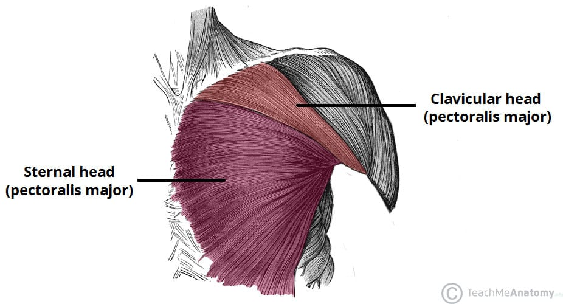

- **Region:** Upper body
- **Training split:** push
- **Training role:** Prime mover on horizontal push; upper fibers assist incline and some overhead work.
- **Function:** Shoulder horizontal adduction, flexion, internal rotation.
- **Example exercises:** Bench Press, Incline Press, DB Fly, Decline Fly
- **Movement patterns:** Horizontal Push, Deceleration / Catching

## Anterior Delts

- **Region:** Upper body
- **Training split:** push
- **Training role:** Prime mover on overhead pressing and the front-of-shoulder contribution to incline and bench work.
- **Function:** Shoulder flexion. Front head of the deltoid on vertical and horizontal pushes.
- **Example exercises:** OHP, Incline Press
- **Movement patterns:** Vertical Push, Horizontal Push

## Lateral Delts

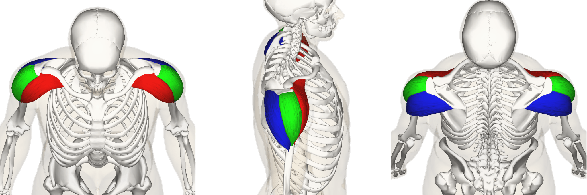

- **Region:** Upper body
- **Training split:** push
- **Training role:** Shoulder abduction and the cap of the deltoid on overhead presses and raises.
- **Function:** Shoulder abduction. Lateral head that sets the arm path on vertical push.
- **Example exercises:** Lateral Raise, DB Shoulder Press
- **Movement patterns:** Vertical Push

## Triceps

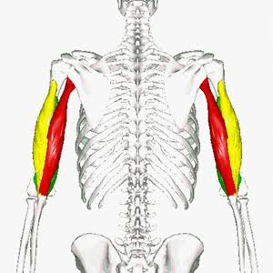

- **Region:** Arms
- **Training split:** push
- **Training role:** Elbow extensor and press lockout. Shows up on every vertical and horizontal push, then again on isolation extensions.
- **Function:** Elbow extension. Long head extends shoulder, lateral head stabilizes.
- **Example exercises:** Pushdown, Skullcrusher, Diamond Push-up, Overhead Extension
- **Movement patterns:** Vertical Push, Horizontal Push

## Core & Abs

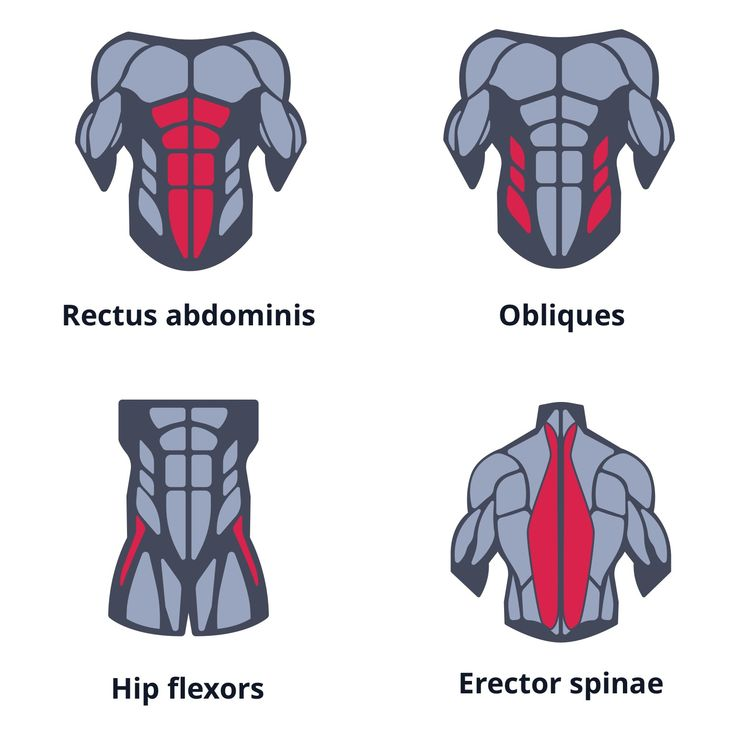

- **Region:** Trunk
- **Training split:** push
- **Training role:** Brace, anti-motion, and some flexion/rotation. Treat it as a cylinder on compounds, then add anti-series and flexion work as needed.
- **Function:** Spinal flexion, rotation, anti-extension, anti-rotation.
- **Example exercises:** Cable Crunch, Dragon Fly, Russian Twist, Plank
- **Movement patterns:** Anti-Rotation & Anti-Lateral, Rotational Acceleration, Loaded Carries

## Lats

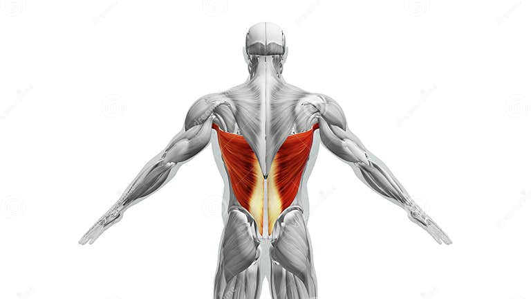

- **Region:** Upper body
- **Training split:** pull
- **Training role:** Prime mover on vertical and horizontal pulls. Width and shoulder extension from overhead and from a row.
- **Function:** Shoulder extension and adduction. Depresses the scapula on vertical pulls.
- **Example exercises:** Pull-up, Lat Pulldown, Meadows Row
- **Movement patterns:** Vertical Pull, Horizontal Pull

## Rhomboids

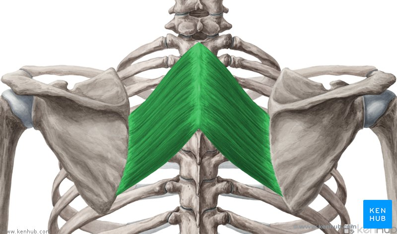

- **Region:** Upper body
- **Training split:** pull
- **Training role:** Scapular retractors that build the upper-back wall behind every press.
- **Function:** Scapular retraction. Pull the shoulder blades toward the spine.
- **Example exercises:** Barbell Row, Seal Row, Face Pull
- **Movement patterns:** Horizontal Pull

## Traps

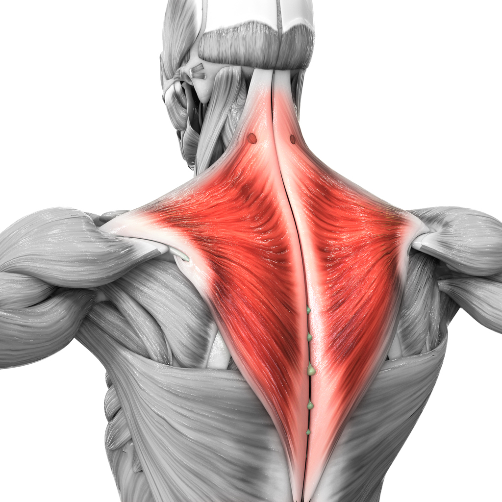

- **Region:** Upper body
- **Training split:** pull
- **Training role:** Postural wall on rows and the packed-shoulder work of carries.
- **Function:** Scapular retraction, elevation, and upward rotation. Middle fibers retract; upper fibers support loaded carries.
- **Example exercises:** Face Pull, Loaded Carry, Shrug-style work from pulls
- **Movement patterns:** Horizontal Pull, Loaded Carries

## Erectors

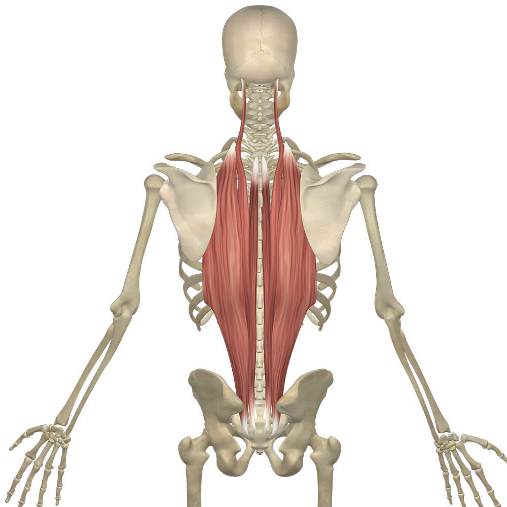

- **Region:** Trunk
- **Training split:** pull
- **Training role:** Spinal extensors that keep the trunk rigid on hinges and squats.
- **Function:** Spinal extension and isometric bracing under axial load.
- **Example exercises:** Deadlift, RDL, Back Squat
- **Movement patterns:** Hinge Pattern, Squat Pattern

## Posterior Delts

- **Region:** Upper body
- **Training split:** pull
- **Training role:** The rear head that balances pressing volume with horizontal pulling.
- **Function:** Shoulder extension and external rotation. Posterior head of the deltoid.
- **Example exercises:** Rear Delt Fly, Face Pull
- **Movement patterns:** Horizontal Pull

## Biceps

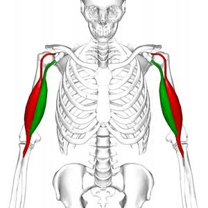

- **Region:** Arms
- **Training split:** pull
- **Training role:** Elbow flexor and pull accessory. Direct curls plus indirect work on every vertical and horizontal pull.
- **Function:** Elbow flexion, supination. Long head contributes to shoulder flexion.
- **Example exercises:** BB Curl, Hammer Curl, Preacher Curl, Reverse Curl
- **Movement patterns:** Horizontal Pull, Vertical Pull

## Forearms & Grip

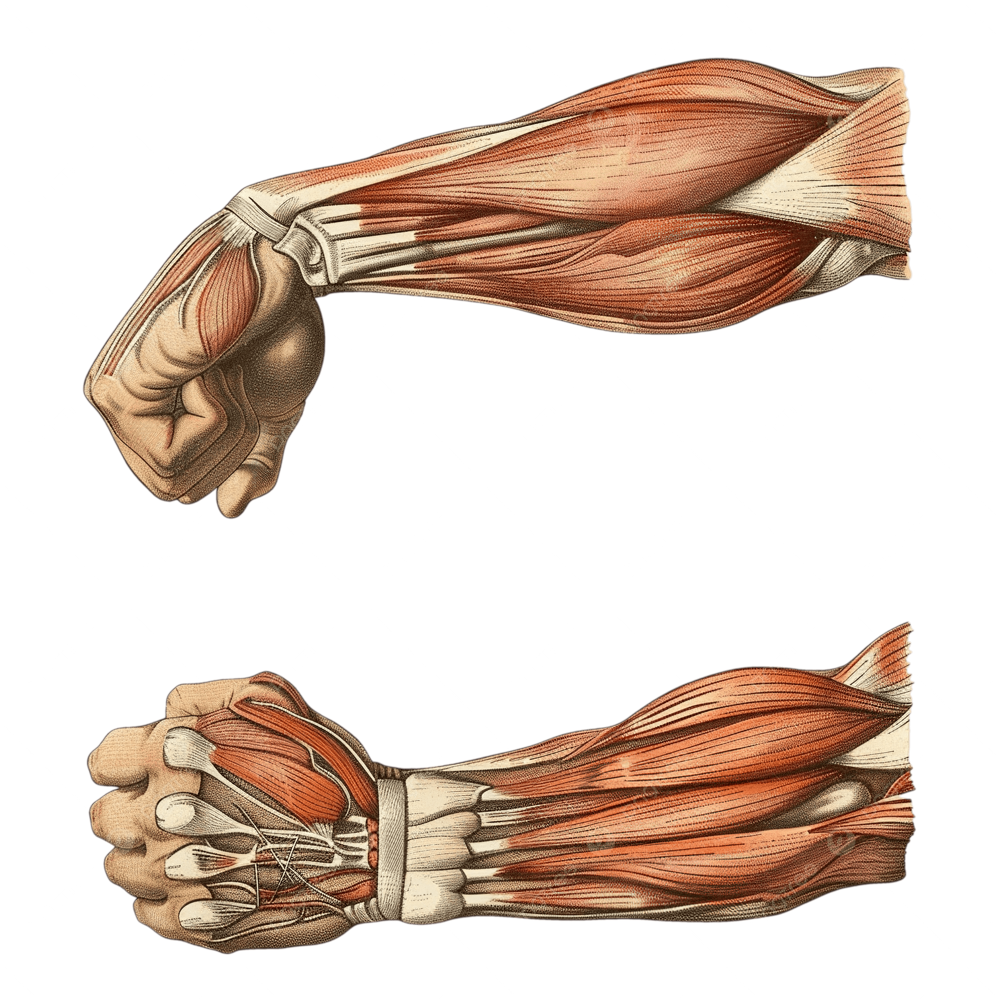

- **Region:** Arms
- **Training split:** pull
- **Training role:** Limiters on pulls, hinges, and carries. Train grip so the hands are not the first thing to quit.
- **Function:** Wrist flexion, extension, pronation, supination.
- **Example exercises:** Wrist Curl, Reverse Curl, Pronation/Supination Twists
- **Movement patterns:** Loaded Carries, Vertical Pull, Horizontal Pull

## Quadriceps

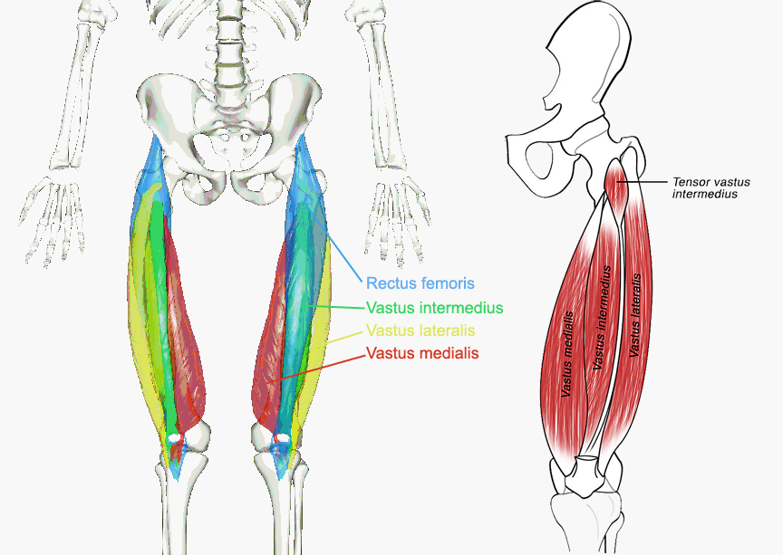

- **Region:** Lower body
- **Training split:** lowerBody
- **Training role:** Knee extension on squats, lunges, and jumps. The main knee-dominant engine.
- **Function:** Knee extension, hip flexion.
- **Example exercises:** Squat, Leg Extension, Bulgarian Split Squat, Goblet Squat
- **Movement patterns:** Squat Pattern, Power / Triple Extension

## Hamstrings

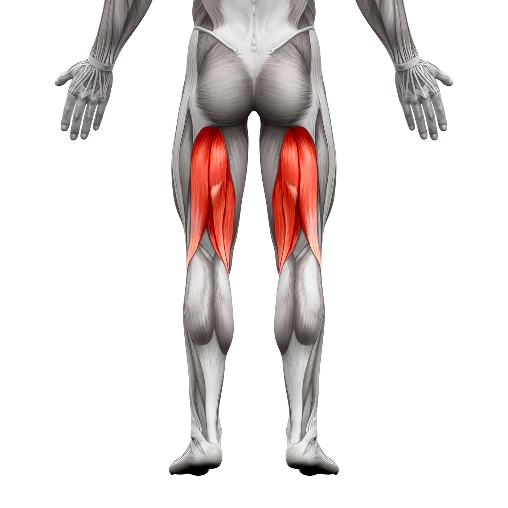

- **Region:** Lower body
- **Training split:** lowerBody
- **Training role:** Hip extension on hinges plus knee flexion on curls. Pair with quads so the posterior chain is not an afterthought.
- **Function:** Knee flexion, hip extension.
- **Example exercises:** Nordic Curl, RDL, Glute Ham Raise, Leg Curl
- **Movement patterns:** Hinge Pattern, Single-Leg Pattern

## Glutes

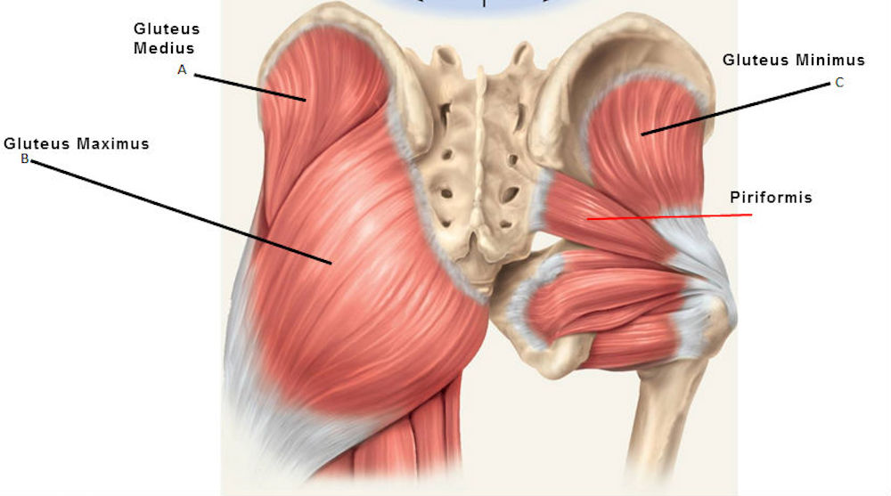

- **Region:** Lower body
- **Training split:** lowerBody
- **Training role:** Hip extension, abduction, and the finish of squats, hinges, and jumps.
- **Function:** Hip extension, abduction, external rotation.
- **Example exercises:** Step-ups, Lunges, Hip Thrust, RDL
- **Movement patterns:** Squat Pattern, Hinge Pattern, Power / Triple Extension

## Calves

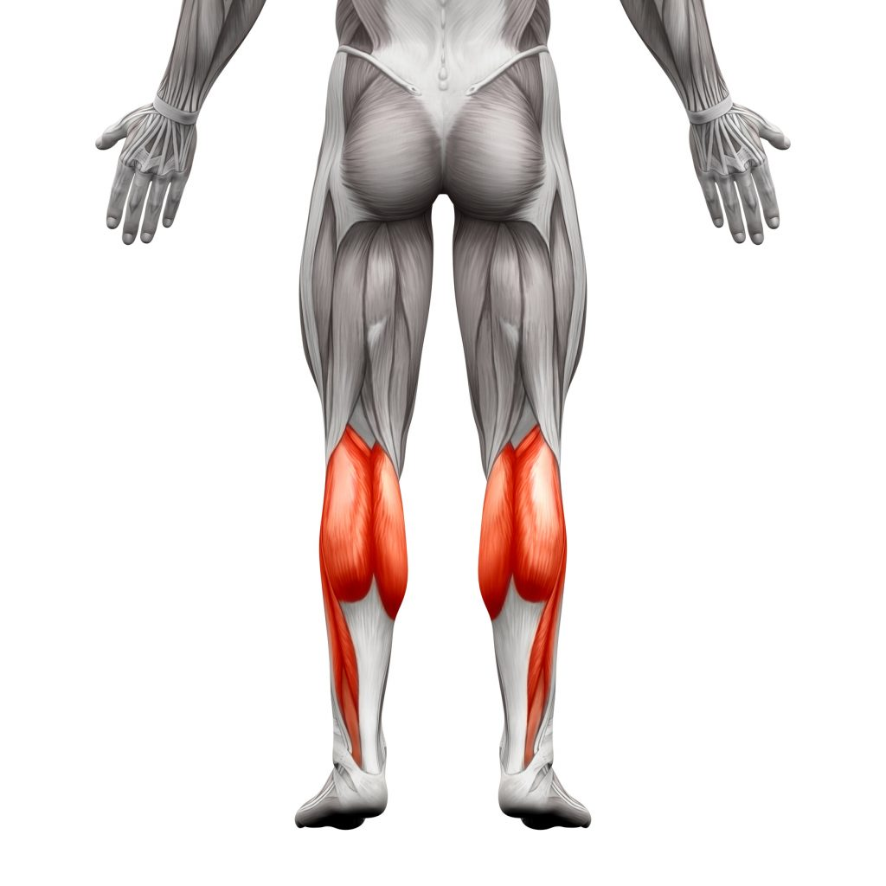

- **Region:** Lower body
- **Training split:** lowerBody
- **Training role:** Ankle plantarflexion and elastic stiffness for gait, jumps, and single-leg work.
- **Function:** Plantarflexion (gastrocnemius and soleus).
- **Example exercises:** Standing / Seated Calf Raise
- **Movement patterns:** Single-Leg Pattern, Power / Triple Extension

## Tibialis

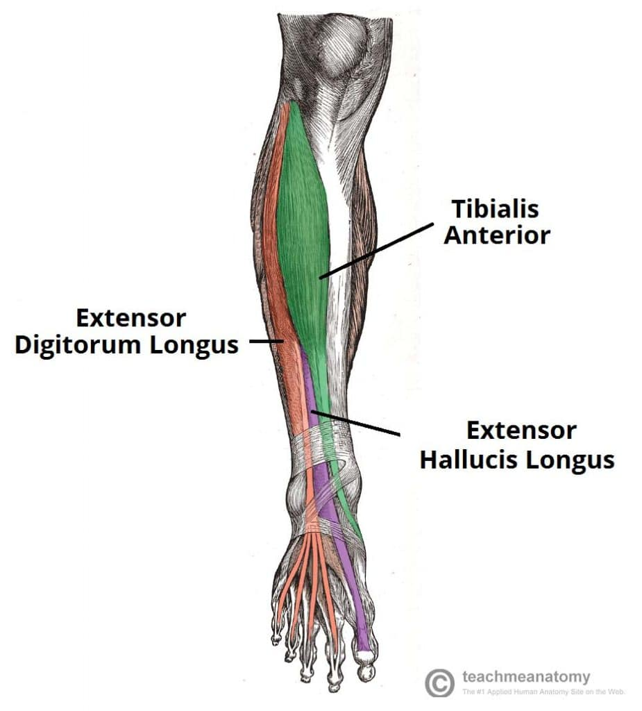

- **Region:** Lower body
- **Training split:** lowerBody
- **Training role:** Ankle dorsiflexion. The front-of-shin counterpart to the calves.
- **Function:** Dorsiflexion (tibialis anterior).
- **Example exercises:** Tibialis Raise
- **Movement patterns:** Single-Leg Pattern

## Adductors

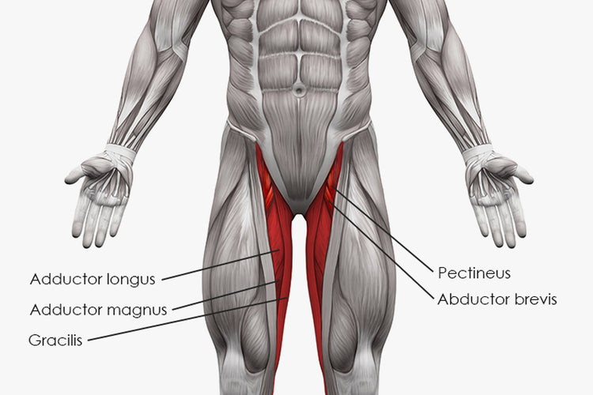

- **Region:** Lower body
- **Training split:** lowerBody
- **Training role:** Share squat depth and stance control. Pelvic stability on squats and lunges.
- **Function:** Adduction (pull the leg in) and pelvic stability.
- **Example exercises:** Copenhagen Adductor, Lateral Lunge
- **Movement patterns:** Squat Pattern, Single-Leg Pattern

## Abductors

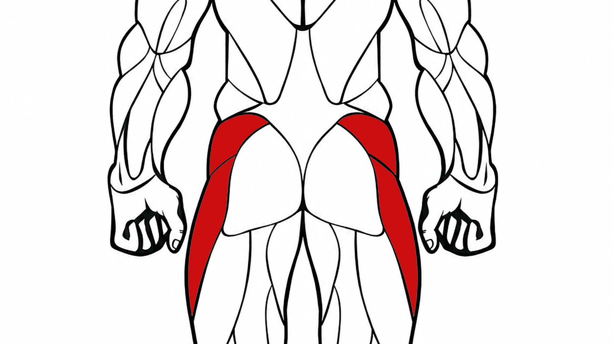

- **Region:** Lower body
- **Training split:** lowerBody
- **Training role:** Keep the pelvis level on lunges and single-leg work.
- **Function:** Abduction (push the leg out) and pelvic stability.
- **Example exercises:** Cable Side Extension, side-lying abduction
- **Movement patterns:** Single-Leg Pattern, Anti-Rotation & Anti-Lateral

## Hip Flexors

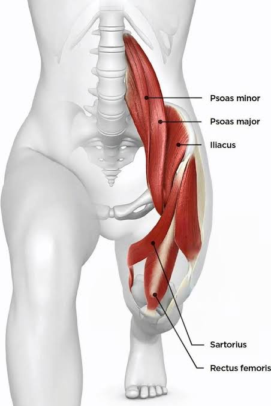

- **Region:** Lower body
- **Training split:** lowerBody
- **Training role:** Swing-leg and knee-drive muscles. They stabilize the pelvis and show up in sprinting, hanging leg raises, and split-stance work.
- **Function:** Hip flexion, stabilizes pelvis.
- **Example exercises:** Reverse Squat, Hanging Leg Raise, Reverse Lunge
- **Movement patterns:** Single-Leg Pattern, Power / Triple Extension
