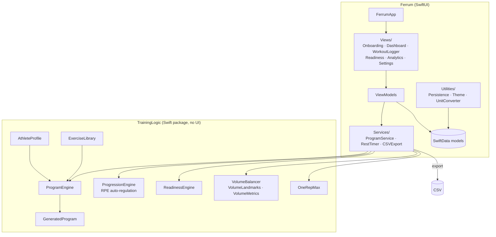

# Architecture

Ferrum is an offline, rule-based strength coach for iOS. Training logic is a pure Swift package; the app is SwiftUI + SwiftData. No network.

```mermaid
flowchart TD
    subgraph App["Ferrum (SwiftUI)"]
        Entry[FerrumApp]
        Views["Views/<br/>Onboarding · Dashboard · WorkoutLogger<br/>Readiness · Analytics · Settings"]
        VM[ViewModels]
        Svc["Services/<br/>ProgramService · RestTimer · CSVExport"]
        Util["Utilities/<br/>Persistence · Theme · UnitConverter"]
        SD[(SwiftData models)]
    end

    subgraph Pkg["TrainingLogic (Swift package, no UI)"]
        Prof[AthleteProfile]
        PE[ProgramEngine] --> GP[GeneratedProgram]
        Lib[ExerciseLibrary] --> PE
        Prog[ProgressionEngine<br/>RPE auto-regulation]
        Ready[ReadinessEngine]
        VB["VolumeBalancer<br/>VolumeLandmarks · VolumeMetrics"]
        ORM[OneRepMax]
    end

    Entry --> Views --> VM
    VM --> Svc
    VM --> SD
    Svc --> PE & Prog & Ready & VB & ORM
    Prof --> PE
    Util --> SD
    Svc -->|export| CSV[(CSV)]
```
